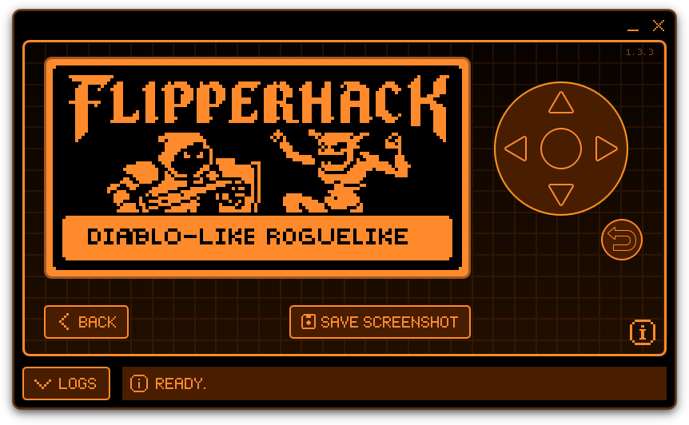

# Flipperhack

A roguelike game for the Flipper Zero.

## Build

`make all` performs the following:

```bash
make clean
make build
make assets
make package
make install
```

You should now be able to run flipperhack from the app menu.

## Manual Installation

- Install flipperhack.fap to /ext/apps/Games/
- Install everything in ./data to /ext/apps_data/flipperhack/

## Controls

- Arrows: move
- Bump: attack
- Center button (short): wait
- Center button (long): menu
- Back button: menu
